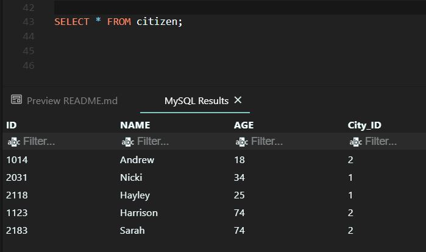
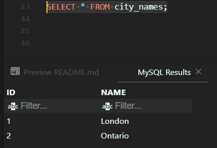
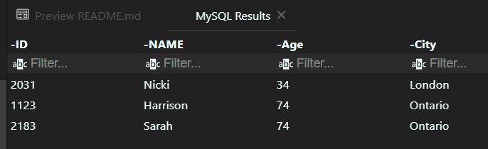

# Simple SQL operations.

`This repository explains about a simple SQL operations such as creating tables, and getting highest number of a group using basic SQL methods like group by and inner join.`

`CREATE_TABLES.sql file explains how to create the tables. The tables images are below`

`First is the citizen table:`

`And then the city_names table:`

`And the expected result is like the image below:`

`There are 2 ways of getting the result. The query for first method is in First_Method.sql, and for the second method is in Second_Method.sql.`